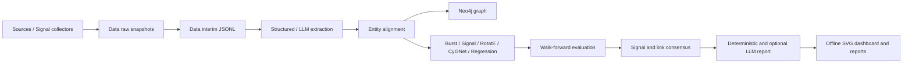

# Local Import and Revision 00

## Goal and assumptions

以 GitHub `wyh828/Merged-pretend-kg-agent` 为项目架构来源，在当前电脑 `F:/Predictive agents` 建立独立本地分支；保留旧工程的代码、配置、数据和未提交改动的可恢复备份。保留上游预测方法，逐个修复已复现的运行错误并检查。

## Provenance and recovery

- Source: https://github.com/wyh828/Merged-pretend-kg-agent
- Imported commit: `1b87827418a5603b2df709a234d769171d655c94`，本次通过 `git ls-remote` 检查 HEAD 并 fetch。
- Local branch: `codex/merged-local-00`；旧提交位置：`codex/checkpoint-before-merged-00`。
- Backup: `.local_backups/pre_merged_import_00/files`（完整旧工程，排除 Git 元数据），另存 `history_00.bundle`、`worktree_00.patch`、`metadata_00.json`。
- 旧配置和原始数据均保留于备份；本次未迁入、未上传，根目录 `.env` 仅配置本机路径和关闭的调度/推送开关。
- `origin` 保持旧远端，新增 `merged-upstream` 指向导入仓库；未推送。推送前需明确选择目标远端。

## Architecture and data flow



主业务代码保留上游 `techtrend/` 结构，采集、存储、预处理、评分、预测、报告仍各自分层；本机验证脚本和记录存入 `Attempt/`。`Data` 与 `data` 在 Windows 指向同一个目录。

## Changes and interfaces

Settings 的既有字段类型不变；相对路径从项目根解析，`data/...`、`output/...` 跟随对应目录覆盖；新增 `CACHE_DIR` 默认 `data/cache`。PyKEEN/PyStow/Torch/Hugging Face 缓存默认位于工程内，显式环境变量仍优先。

全量与每日顺序统一为 collect → extract → align → build_graph → predict → evaluate → collaborate → report → notify → visualize。CLI 阶段失败返回非零。采集器协议与 HTTP 参数遵循已有接口。报告生成可直接消费评估产物。

看板沿用已有 HTML/SVG 实现，增加可选 reports 输入、榜单和协同表格，嵌入 report/eval_report/report_llm/weekly_report 及三份指定计划文档。Markdown 以经过 HTML 转义的原文折叠呈现，不增加渲染依赖。空数据明确显示未验证。

## Environment and commands

本机 Python 3.13.9，`.venv` 使用 `--system-site-packages` 复用 Anaconda；依赖均来自上游 requirements，完整版本快照见 `local_environment_00.txt`。独立重建方式见根 README。

```powershell
Set-Location 'F:\Predictive agents'
& '.\.venv\Scripts\python.exe' -m pytest tests -q --basetemp=output/test_tmp_00 -p no:cacheprovider
& '.\.venv\Scripts\python.exe' -m pip check
& '.\.venv\Scripts\python.exe' Attempt/scripts/verify_local_00.py --inventory --models
& '.\.venv\Scripts\python.exe' main.py --list
& '.\.venv\Scripts\python.exe' main.py --stage visualize
```

模型检查仅用 8 条合成事实、CPU、1 轮训练，验证依赖和接口执行能力；得到的指标不得用于预测质量比较。81 个模块通过导入，448 项函数接口已登记，但没有宣称每个函数都完成真实数据验证。

54 项测试通过；compileall、pip check、git diff --check 通过。无数据 evaluate 实际退出 1，空状态 visualize 实际退出 0；测试同时覆盖存在榜单和协同结果的看板。模型 CPU 运行出现无加速器与保守 batch_size 提示，未出现训练异常。

一次提权复查在系统临时目录遇到 ACL 冲突；使用项目 output/test_tmp_00 临时测试目录并关闭 pytest 缓存后全套通过。该目录由 pytest 重建，只保存合成测试文件。

## Problems and next steps

专项修复与检查映射见 `function_review_00.md`，阶段阻塞和成果见根 README。本机未配置 Neo4j 密码和 API key，未采集新数据，未运行真实数据全流程，未复现上游实验数字。评估方法变更等待用户复核；旧数据是否迁入等待用户选择。不要将旧备份直接覆盖新 interim 数据：两者 schema 与概念粒度需要先校验。
